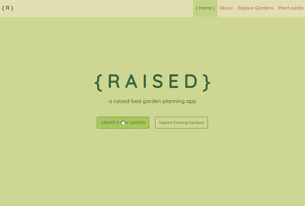

# &#123; R A I S E D &#125;

__{ R A I S E D }__ is a raised-bed garden planning web application.

*This is the back-end repo of this project The front-end source code can be found [here](https://github.com/raquii/raised-front-end)*

## General Information

I created this project for FlatIron School's Software Engineering Bootcamp. This project uses a React front-end, with a Ruby back-end using ActiveRecord, Rack, and SQLite for the database.

I built this app because it is something I wanted for myself, to be quite honest. I can't wait to use it to plan my own raised-beds.

To see a demo of the application, [video walkthrough](https://youtu.be/3z6XsOGe6Mw).

## Room for Improvment

🔲 Add herbs and fruits to database

🔲 Allow user to access plant-pedia on garden planner page

🔲 User auth, private gardens

### Sources

* I found the following website very helpful in my research for my Plant-pedia:
  * [Gardener's Supply Company](https://www.gardeners.com/)
  * [The Old Farmer's Almanac](https://www.almanac.com/)
  * [Better Homes & Gardens: Garden Plans](https://www.bhg.com/gardening/plans/)
